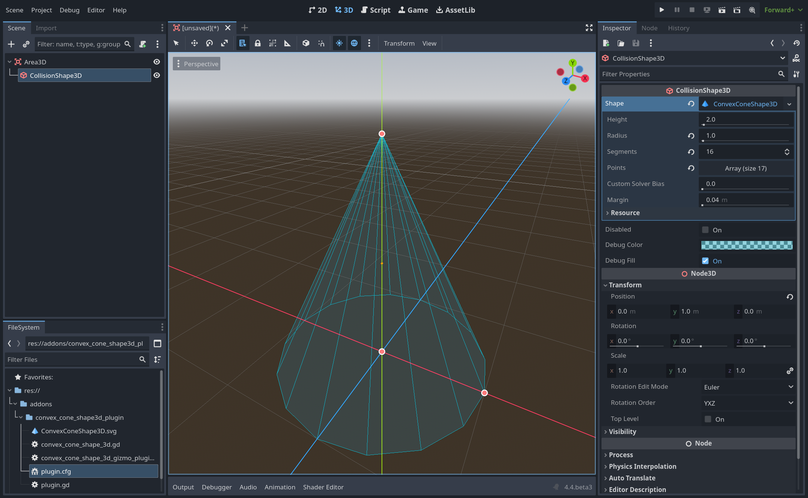

# Convex Cone Shape 3D Plugin for Godot

A simple Godot plugin that adds a convex cone shape for 3D.

## Features
- Adds a new `ConvexConeShape3D`.
- Adds a new gizmo for `CollisionShape3D`.

## Installation
1. Download or clone this repository.
2. Copy `addons` folder into your Godot project's folder.
3. Enable the plugin in **Project Settings > Plugins**.

## Usage
- After enabling the plugin, you can add a `ConvexConeShape3D` to your areas and physics bodies.
- Use it in `CollisionShape3D` for collision detection.

## Compatibility
- Developed for Godot 4.4.
- May not work in older versions.

## License
This project is licensed under the MIT License. Feel free to modify and use it in your projects.
